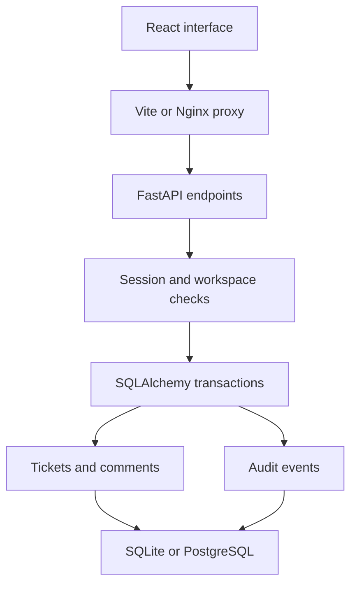

# SupportDesk

A full-stack support ticket workspace with a React interface, a FastAPI API, and SQL-backed persistence. Teams can triage requests, assign work, leave updates, and review the history behind a ticket.

This is a runnable portfolio application with real authentication, workspace authorization, and conflict detection. It runs locally with SQLite and can use PostgreSQL through Docker Compose.


## What it solves

Internal requests often arrive across chat and email without an owner or a clear status. SupportDesk puts the request, assignment, conversation, and change history in one place.

The implementation focuses on software engineering concerns that also appear in larger applications: enforcing access at the API boundary, modeling relationships, validating input, preventing stale writes, and testing failure cases.

## Features

- Register an account and create a workspace; sign in and revoke a session on sign-out.
- List the workspaces you belong to and switch between them.
- Create, read, update, and archive tickets.
- Search ticket titles; filter by status and priority; paginate results on the server.
- Assign tickets only to members of the same workspace.
- Add comments and inspect the workspace's latest 50 audit events.
- Reopen resolved tickets through explicit status transitions.
- Detect stale edits and return HTTP `409` instead of silently overwriting newer work.
- Responsive UI, empty states, request errors, validation, and loading feedback.
- OpenAPI documentation and a database health endpoint.

## Stack

| Layer | Technology |
| --- | --- |
| Web | React 18, TypeScript, Vite, Lucide icons, CSS |
| API | Python 3.12, FastAPI, Pydantic |
| Persistence | SQLAlchemy 2, SQLite locally, PostgreSQL 16 in Compose |
| Authentication | Scrypt password hashes; hashed, opaque bearer sessions |
| Tests | Pytest and FastAPI TestClient |
| Delivery | Docker, Nginx, GitHub Actions |

## Quick start

Requirements: **Python 3.12** and **Node.js 22**. No database server, paid API, cloud account, or external key is required for the local version.

Download this project or clone your own repository, then open a terminal in its root directory.

### 1. Start the API

**Windows PowerShell:**

```powershell
cd backend
py -3.12 -m venv .venv
.\.venv\Scripts\python.exe -m pip install -r requirements-dev.txt
$env:DEMO_PASSWORD = "ChooseYourOwnDemoPassword42"
.\.venv\Scripts\python.exe -m app.seed
.\.venv\Scripts\python.exe -m uvicorn app.main:app --host 127.0.0.1 --port 8000
```

**macOS / Linux:**

```bash
cd backend
python3.12 -m venv .venv
.venv/bin/python -m pip install -r requirements-dev.txt
DEMO_PASSWORD='ChooseYourOwnDemoPassword42' .venv/bin/python -m app.seed
.venv/bin/python -m uvicorn app.main:app --host 127.0.0.1 --port 8000
```

The seed command creates `demo@supportdesk.local`, the **Acme Engineering** workspace, and seven example tickets. Supply your own password with 12–128 characters. Re-running the command preserves the existing account and data; it does not reset the password.

Seeding is optional. You can also select **Create a workspace** in the UI and register an account.

### 2. Start the web app

Open a second terminal in the project root:

```bash
cd frontend
npm ci
npm run dev
```

Open **http://127.0.0.1:5173** and sign in with `demo@supportdesk.local` and the password you supplied to the seed command.

| Local address | Purpose |
| --- | --- |
| http://127.0.0.1:5173 | Application |
| http://127.0.0.1:8000/docs | Interactive API documentation |
| http://127.0.0.1:8000/api/health | Database connectivity check |

Vite proxies `/api` requests to port 8000. The SQLite database is created as `backend/supportdesk.db` when the API starts. Keep the API's working directory set to `backend` so the database location stays consistent.

### Try the workflow

1. Open a seeded ticket and move it from **Open** to **In progress**.
2. Assign it to yourself and add a comment.
3. Check **Activity log** for the recorded changes.
4. Open the same ticket in two browser tabs. Save in one tab, then try saving the older version in the other. The second save is rejected; select **Reload latest version** before editing again.
5. Create another account in a private browser window. The owner can add its email under **Team members**. That user can refresh or sign in again to see both workspaces.

A resolved ticket must be reopened before moving back to **In progress**. Only the creator or workspace owner can archive a ticket. Archiving hides the ticket from the active inbox and retains its data and history.

## Run with PostgreSQL and Docker

Requirements: Docker with the Compose plugin.

1. Copy `.env.example` to `.env` in the project root.
2. Replace `SUPPORTDESK_DB_PASSWORD` with a long, random **alphanumeric** value. The example Compose file embeds it in a connection URL, so URL-reserved characters require encoding.
3. Run:

```bash
docker compose up --build -d
```

Open **http://localhost:8080** and register an account, or seed the demo:

```bash
docker compose exec -e DEMO_PASSWORD=ChooseYourOwnDemoPassword42 backend python -m app.seed
```

The frontend's Nginx server forwards API calls to the backend. PostgreSQL is reachable only on the Compose network; local frontend and API ports bind to loopback. Database data persists in a named volume.

```bash
docker compose down
```

This stops the services without deleting the database volume. The Docker path is included for reproducibility; its execution was not verified in the creation environment because Docker was unavailable.

## Configuration

| Setting | Default | Purpose |
| --- | --- | --- |
| `DATABASE_URL` | `sqlite:///./supportdesk.db` | SQLAlchemy connection URL |
| `CORS_ORIGINS` | `http://localhost:5173,http://localhost:8080` | Comma-separated origins for direct cross-origin API access |
| `DEMO_PASSWORD` | No default | Explicit password used only by the demo seed command |
| `SUPPORTDESK_DB_PASSWORD` | No application default | PostgreSQL password used by Compose |
| `TEST_DATABASE_URL` | Temporary SQLite database per test | Optional disposable PostgreSQL database for tests |

Local Python execution reads exported environment variables; it does not automatically load `.env`. Docker Compose reads the root `.env` file.

## API summary

All workspace endpoints require a valid bearer session and membership in the requested workspace. Unauthorized workspace and ticket lookups return `404` to avoid disclosing their existence.

| Method | Path | Behavior |
| --- | --- | --- |
| `POST` | `/api/auth/register` | Create account, workspace, and session |
| `POST` | `/api/auth/login` | Issue a 12-hour session |
| `POST` | `/api/auth/logout` | Revoke the current session |
| `GET` | `/api/auth/me` | Return the signed-in user |
| `GET` | `/api/workspaces` | List authorized workspaces |
| `GET`, `POST` | `/api/workspaces/{id}/members` | List members; owners can add an existing account |
| `GET` | `/api/workspaces/{id}/stats` | Return active ticket counts by status |
| `GET`, `POST` | `/api/workspaces/{id}/tickets` | Search/list tickets or create a ticket |
| `GET`, `PATCH`, `DELETE` | `/api/workspaces/{id}/tickets/{ticket_id}` | Read, edit, or archive |
| `POST` | `/api/workspaces/{id}/tickets/{ticket_id}/comments` | Add a comment |
| `GET` | `/api/workspaces/{id}/activity` | Latest 50 audit events; optional `ticket_id` filter |

Ticket list parameters: `q`, `status`, `priority`, `page`, and `page_size` (maximum 50). Search matches the title and treats `%` and `_` as literal characters.

Every ticket edit includes its current `version`. A successful edit increments it. Archiving requires `?version=N`. The server uses a conditional SQL update, so authorization alone is not enough to overwrite a stale version. Comments do not change the ticket-edit version.

## Architecture and decisions



- **Workspace isolation:** Membership is checked before every workspace action. Ticket queries also constrain the workspace ID, including when a user belongs to multiple workspaces.
- **Session handling:** Passwords use salted scrypt hashes. Sessions use random tokens; only SHA-256 token digests are stored. Tokens expire after 12 hours and are revoked at logout. The web app keeps its token in `sessionStorage` rather than persistent local storage.
- **Consistency:** Ticket mutations and their audit entries commit in the same transaction. Version checks use `UPDATE ... WHERE version = expected_version` to prevent lost updates.
- **Archiving:** Deleting a ticket marks it archived. This preserves audit and comment references while removing it from active lists and counts.
- **Search and pagination:** Filtering and pagination happen in SQL. Stable secondary ordering by ticket ID avoids ambiguous ordering for identical update timestamps.
- **Simple local setup:** SQLite makes first-run setup small. PostgreSQL uses the same model layer and is included in the CI test matrix.

## Tests and build

From `backend`:

```bash
.venv/bin/python -m pytest -q
```

Windows equivalent:

```powershell
.\.venv\Scripts\python.exe -m pytest -q
```

From `frontend`:

```bash
npm ci
npm run build
```

Tests cover registration/login/logout, expired sessions, cross-workspace access attempts, assignment restrictions, owner-only membership changes, archive permissions, optimistic concurrency conflicts, status transitions, comments, audit retention, search escaping, pagination, and invalid input.

CI runs backend tests against SQLite and PostgreSQL, plus the TypeScript check and Vite production build. `TEST_DATABASE_URL` must point to a disposable database: the fixture drops application tables between tests. PostgreSQL CI results are available after publishing and running the workflow; they are not claimed as locally verified.

Local verification: **8 API tests passed** with SQLite, and the TypeScript/Vite production build passed. Browser checks covered seeded login, ticket creation, assignment, status updates, persisted comments, activity, search, and mobile workspace/sign-out controls. Desktop and 390px mobile layouts were inspected.

## Scope and tradeoffs

This is a portfolio application, not a hosted customer support service. It deliberately keeps the initial feature set focused.

- Membership is added by the owner using an existing account email; no email delivery or invitation acceptance flow is included.
- Schemas are created for a fresh database at startup. Schema changes require a migration plan before retaining production data across versions; an automatic migration system is not included.
- There is no password reset, MFA, login rate limiter, attachment upload, email notification, or real-time push channel.
- Session tokens are accessible to JavaScript. A public deployment should assess a hardened cookie-based session design, CSRF protection, HTTPS, rate limiting, and CSP against its requirements.
- The audit log records application events; it is not an immutable compliance ledger. The activity screen shows the latest 50 events.
- The single-workspace inbox provides application-level isolation; row-level database policies are not configured.

## Repository map

| Path | Purpose |
| --- | --- |
| `backend/app/main.py` | API, authorization checks, ticket transactions |
| `backend/app/models.py` | Relational data model |
| `backend/app/schemas.py` | Request validation |
| `backend/app/security.py` | Password hashing and token digests |
| `backend/app/seed.py` | Explicit, repeatable demo creation |
| `backend/tests/test_api.py` | Behavioral API tests |
| `frontend/src/main.tsx` | UI and API interaction |
| `frontend/src/styles.css` | Responsive layout and visual styling |
| `compose.yaml` | PostgreSQL, API, and web containers |
| `.github/workflows/ci.yml` | API tests and frontend build |

## Talking through the project

Useful code-review questions:

1. Why check both workspace membership and the ticket's workspace ID?
2. Why can an authenticated request still receive `404`?
3. How does the conditional SQL update prevent two editors from overwriting each other?
4. What changes when moving from a local SQLite database to PostgreSQL?
5. What would you add before making registration publicly accessible?

Read and run the implementation before presenting it in an interview. Add your own improvements and describe the contribution you actually made.

## License

MIT. See [LICENSE](LICENSE).
